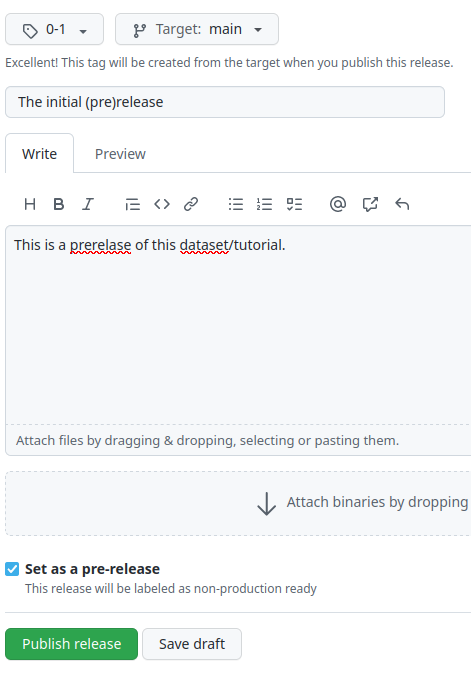

The Unofficial Guide on applying NCN Open Access rules to GitHub repositories
=========

How to deal with NCN Open Access rules and GitHub repositories - **the unofficial guide**.

 

**Notice of Non-Affiliation and Disclaimer**. We are not affiliated, associated, authorized, endorsed by, or in any way officially connected with the GitHub, NCN, or Zenodo.

# How to

1. Add a `LICENSE` file to your GitHub repository [as we did here](LICENSE), if you don't have one.

1. In your repository, create a `CITATION.cff` file with a citation details.
    - You can edit the [this sample one here](CITATION.cff) or use [this wizard](https://citation-file-format.github.io/cff-initializer-javascript) to create one from scratch
    - The format of file is YAML.
    - license: for data sets it has to be CC0 1.0. What about software? :question:
    - After commit, the citation tool will be available on the right repository panel: 

1. In your repository, create a `.zenodo.json` file. You can edit the [this sample one here](.zenodo.json).
   - Add your grant number in the field *"notes"*.
   - :warning: polish grants **does not** work with the dedicated field "grants/funding".
   - some more information on the format and fields are [available here](https://developers.zenodo.org/#introduction).
   - The format of file is json.
   - license: for data sets it has to be CC0 1.0. What about software? :question:

1. Connect Zenodo with GitHub (or vice versa) as [described here](https://docs.github.com/en/repositories/archiving-a-github-repository/referencing-and-citing-content).
   - Your GitHub settings will be available at [https://zenodo.org/account/settings/github/](https://zenodo.org/account/settings/github/).
   - Enable the integration by switching the repository on: 

   - Go to GitHub and make your first release or pre-release: 
 

   - at this point your repository will be visible at the appropriate Zenodo page. Please note the status - green means ok, orange means processing, red means error 

   - at this point you can add a repository DOI identifier issued by Zenodo to the `.zenodo.json` file (see above). See below on how to get the universal DOI.

2. New DOI is generated every time you do a release (or pre-release) of your repository.
   - each release has a new DOI.
   - to get the one-universal DOI for your repository, at the Zenodo page, right panel, look for *Cite all versions? You can cite all versions by using the DOI...*: 

   - you can add a cool zenodo badge to your repo:
  

## Additional remarks and optional steps:

1. You may want to enable GitHub actions to chceck validity of `CITATION.cff`, as is done in this repo (`.github/workflows/cffconvert.yml`). You will get a cool badge: 

# Unanswered questions

1. The GitHub repository has an unique DOI, and the following up, peer-reviewed scientific paper also has its own DOI. We (the scientists) want to get citations from the scientific paper. Questions:
   - shall we require others to cite both GitHub repo and scientific paper? Or only the paper?
   - if both are cited, can we merge both citations (eg in Google Scholar)?
